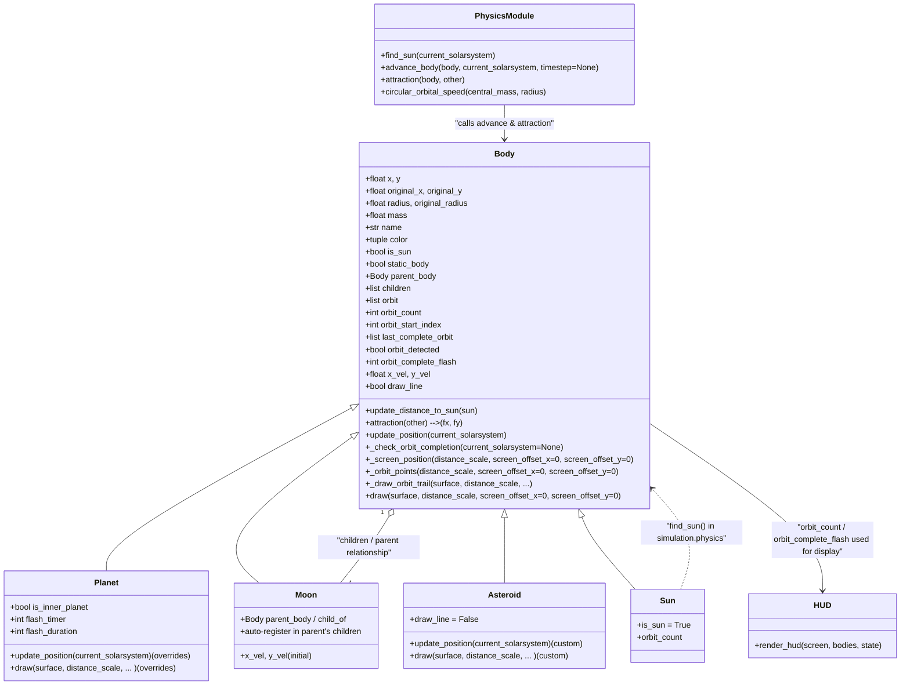

# Class Diagram (Mermaid)


```mermaid
classDiagram
    %% Inheritance
    Body <|-- Planet
    Body <|-- Moon
    Body <|-- Asteroid
    Body <|-- Sun

    %% Body (base)
    class Body {
        +float x, y
        +float original_x, original_y
        +float radius, original_radius
        +float mass
        +str name
        +tuple color
        +bool is_sun
        +bool static_body
        +Body parent_body
        +list children
        +list orbit
        +int orbit_count
        +int orbit_start_index
        +list last_complete_orbit
        +bool orbit_detected
        +int orbit_complete_flash
        +float x_vel, y_vel
        +bool draw_line
        +update_distance_to_sun(sun)
        +attraction(other) --> (fx, fy)
        +update_position(current_solarsystem)
        +_check_orbit_completion(current_solarsystem=None)
        +_screen_position(distance_scale, screen_offset_x=0, screen_offset_y=0)
        +_orbit_points(distance_scale, screen_offset_x=0, screen_offset_y=0)
        +_draw_orbit_trail(surface, distance_scale, ...)
        +draw(surface, distance_scale, screen_offset_x=0, screen_offset_y=0)
    }

    class Planet {
        +bool is_inner_planet
        +int flash_timer
        +int flash_duration
        +update_position(current_solarsystem) (overrides)
        +draw(surface, distance_scale, ... ) (overrides)
    }

    class Moon {
        +Body parent_body / child_of
        +x_vel, y_vel (initial)
        +auto-register in parent's children
    }

    class Asteroid {
        +draw_line = False
        +update_position(current_solarsystem) (custom)
        +draw(surface, distance_scale, ... ) (custom)
    }

    class Sun {
        +is_sun = True
        +orbit_count
    }

    %% Associations / notes
    Body "1" o-- "*" Moon : "children / parent relationship"
    Sun ..> Body : "find_sun() in simulation.physics"

    %% Simulation helpers (module-level functions)
    class PhysicsModule {
        +find_sun(current_solarsystem)
        +advance_body(body, current_solarsystem, timestep=None)
        +attraction(body, other)
        +circular_orbital_speed(central_mass, radius)
    }

    %% UI note
    class HUD {
        +render_hud(screen, bodies, state)
    }

    PhysicsModule --> Body : "calls advance & attraction"
    Body --> HUD : "orbit_count / orbit_complete_flash used for display"
```
```
