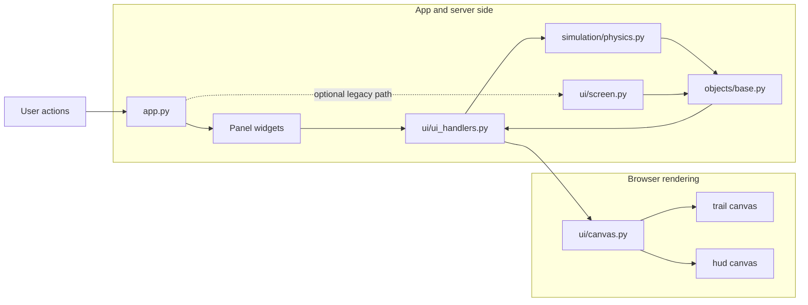

# Workflow and Rendering Architecture

```mermaid
flowchart LR
    User[User actions]

    subgraph AppSide[App and server side]
        App[app.py]
        Controls[Panel widgets]
        Handlers[ui/ui_handlers.py]
        Physics[simulation/physics.py]
        Bodies[objects/base.py]
        Offscreen[ui/screen.py]
    end

    subgraph BrowserSide[Browser rendering]
        Canvas[ui/canvas.py]
        Trail[trail canvas]
        Hud[hud canvas]
    end

    User --> App
    App --> Controls
    Controls --> Handlers
    Handlers --> Physics
    Physics --> Bodies
    Bodies --> Handlers
    Handlers --> Canvas
    Canvas --> Trail
    Canvas --> Hud
    App -. optional legacy path .-> Offscreen
    Offscreen --> Bodies
```